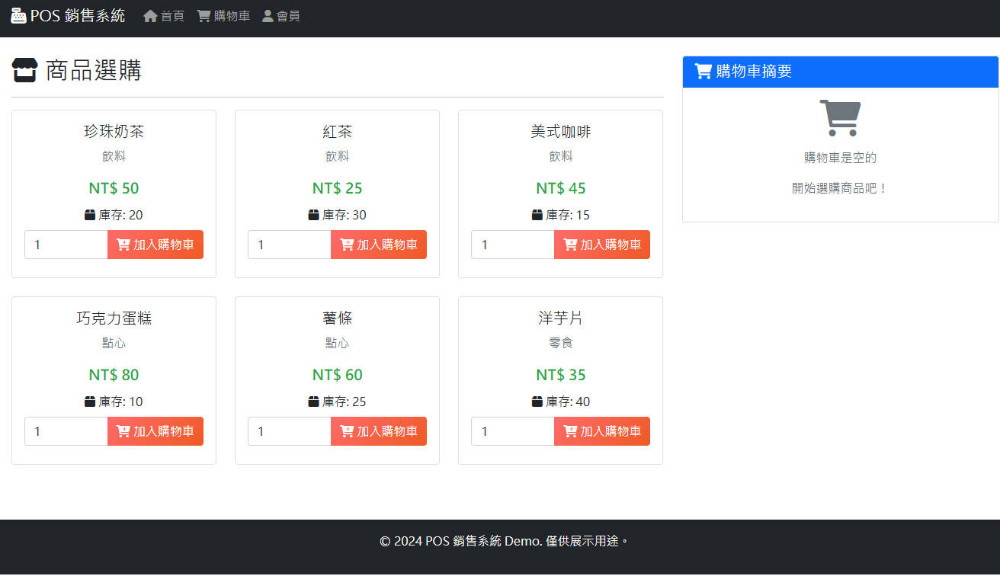

# POS 销售系统 Demo



这是一个基于 Python Flask 的简易 POS (Point of Sale) 销售系统示范应用程序，专为展示零售和餐饮业的销售流程而设计。

## 功能特色

### 商品与购物车管理
- 商品清单展示（饮料、点心、零食）
- 加入购物车功能
- 数量调整与删除
- 自动计算小计、税金、总额

### 结账流程
- 快速结账功能
- 多种付款方式支持（现金、信用卡、行动支付）
- 电子收据产生

### 会员系统
- 会员登录（仅需会员编号）
- 会员等级制度（金卡、银卡、普通）
- 专属折扣优惠

### 促销与折扣
- 会员折扣（金卡 10%、银卡 5%）
- 满额折扣（满 NT$ 500 享 9 折）
- 折扣明细显示

### 库存管理
- 实时库存追踪
- 自动库存扣减
- 缺货警示

## 技术规格

- **框架**: Python Flask
- **前端**: Bootstrap 5 + Font Awesome
- **数据存储**: 内存（Session）
- **无数据库依赖**

## 安装与执行

### 1. 环境需求
```bash
Python 3.7+
pip
```

### 2. 安装依赖
```bash
pip install -r requirements.txt
```

### 3. 启动应用程序
```bash
python app.py
```

### 4. 开启浏览器
```
http://localhost:5000
```

## 使用指南

### 测试会员编号
- **M001** - 张小明 (金卡会员，10% 折扣)
- **M002** - 李小华 (银卡会员，5% 折扣)
- **M003** - 王大明 (普通会员，无折扣)

### 示范流程
1. 浏览商品并加入购物车
2. 登录会员以获得折扣
3. 查看购物车并调整商品
4. 前往结账页面选择付款方式
5. 完成付款后查看收据

## 项目结构

```
VibeCodingPOS/
├── app.py                 # 主应用程序
├── requirements.txt       # 依赖套件
├── PRD.md                 # 产品需求文件
├── templates/             # HTML 模板
│   ├── base.html         # 基础模板
│   ├── index.html        # 首页
│   ├── cart.html         # 购物车页面
│   ├── member.html       # 会员登录页面
│   ├── checkout.html     # 结账页面
│   └── receipt.html      # 收据页面
└── static/               # 静态文件（CSS、JS、图片）
```

## 特色功能

- 现代化响应式设计
- 支持手机与平板
- 收据打印功能
- 实时库存更新
- 智能折扣计算
- Session 内存管理

## 注意事项

- 此为示范系统，所有数据存储在内存中
- 重新启动应用程序将清除所有数据
- 仅供教育与展示用途

## 开发团队

- **项目名称**: VibeCoding POS
- **技术顾问**: Cascade AI
- **版本**: Demo v1.0

---
