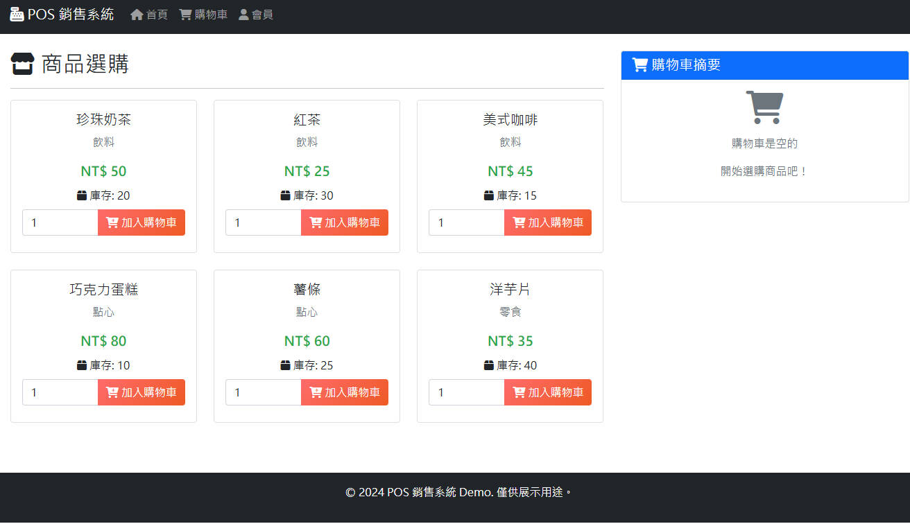

# 🛒 POS 銷售系統 Demo



這是一個基於 **Python Flask** 的簡易 POS (Point of Sale) 銷售系統示範應用程序，專為展示零售和餐飲業的銷售流程而設計。🚀

## ✨ 功能特色

### 📦 商品與購物車管理
- 🛍️ 商品清單展示（飲料、點心、零食）
- 🛒 加入購物車功能
- 🔢 數量調整與刪除
- 💰 自動計算小計、稅金、總額

### 💳 結賬流程
- ⚡ 快速結賬功能
- 💵 多種付款方式支持（現金、信用卡、行動支付）
- 🧾 電子收據產生

### 👤 會員系統
- 🔑 會員登錄（僅需會員編號）
- 🎖️ 會員等級制度（金卡、銀卡、普通）
- 🎁 專屬折扣優惠

### 🏷️ 促銷與折扣
- 💎 會員折扣（金卡 10%、銀卡 5%）
- 🎊 滿額折扣（滿 NT$ 500 享 9 折）
- 📊 折扣明細顯示

### 📋 庫存管理
- ⏱️ 實時庫存追蹤
- 📉 自動庫存扣減
- ⚠️ 缺貨警示

## 🛠️ 技術規格

- **框架**: Python Flask 🐍
- **前端**: Bootstrap 5 + Font Awesome 🎨
- **數據存儲**: 內存（Session）💾
- **無數據庫依賴** ⚡

## 🚀 安裝與執行

### 1. 環境需求 📋
```bash
Python 3.7+
pip
```

### 2. 安裝依賴 📦
```bash
pip install -r requirements.txt
```

### 3. 啟動應用程序 ▶️
```bash
python app.py
```

### 4. 開啟瀏覽器 🌐
```
http://localhost:5000
```

## 📖 使用指南

### 🧪 測試會員編號
- **M001** - 張小明 (🥇 金卡會員，10% 折扣)
- **M002** - 李小華 (🥈 銀卡會員，5% 折扣)
- **M003** - 王大明 (🥉 普通會員，無折扣)

### 🔄 示範流程
1. 瀏覽商品並加入購物車 🛍️
2. 登錄會員以獲得折扣 🔑
3. 查看購物車並調整商品 🛒
4. 前往結賬頁面選擇付款方式 💳
5. 完成付款後查看收據 🧾

## 📂 項目結構

```
VibeCodingPOS/
├── app.py                 # 主應用程序 ⚙️
├── requirements.txt       # 依賴套件 📦
├── PRD.md                 # 產品需求文件 📄
├── templates/             # HTML 模板 🎨
│   ├── base.html         # 基礎模板
│   ├── index.html        # 首頁
│   ├── cart.html         # 購物車頁面
│   ├── member.html       # 會員登錄頁面
│   ├── checkout.html     # 結賬頁面
│   └── receipt.html      # 收據頁面
└── static/               # 靜態文件（CSS、JS、圖片）🖼️
```

## 🌟 特色功能

- 📱 現代化響應式設計
- 💻 支持手機與平板
- 🖨️ 收據打印功能
- 🔄 實時庫存更新
- 🧠 智能折扣計算
- 💾 Session 內存管理

## ⚠️ 注意事項

- 💡 此為示範系統，所有數據存儲在內存中
- 🔄 重新啟動應用程序將清除所有數據
- 🎓 僅供教育與展示用途

## 👥 開發團隊

- **項目名稱**: VibeCoding POS 🛒
- **技術顧問**: Cascade AI 🤖
- **版本**: Demo v1.0 📌

---
